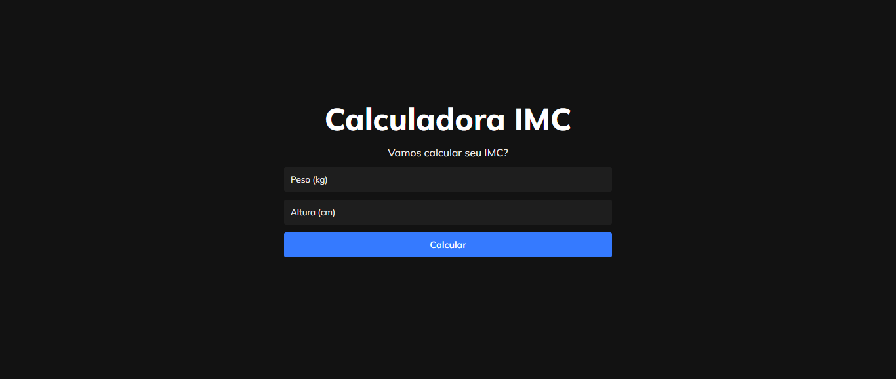
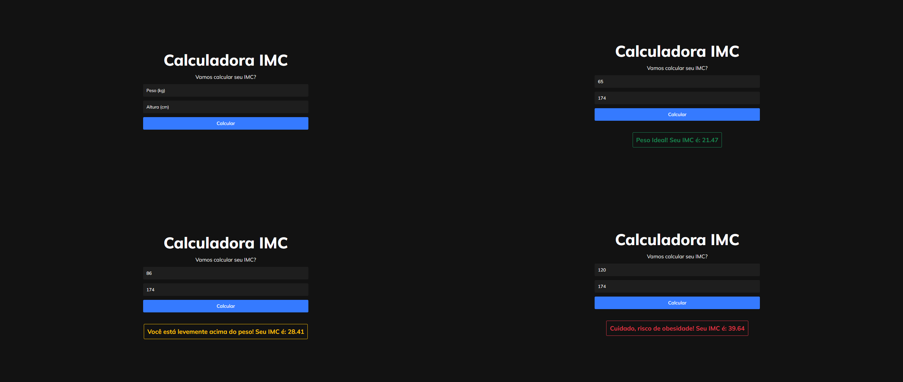

<h1 align="center">
    
</h1>

<h2 align="center"> 
	<p>Calculadora IMC</p>
</h2>

<p align="center">
    
    
</p>

  


## 💻 Sobre o projeto

A proposta desse projeto foi criar uma calculadora de IMC, onde há campos para que o usuário digite seu peso e altura e a partir dessas informações é gerada uma mensagem para o usuário com o cálculo de seu IMC.


## 🔎 Preview do projeto

<p align="center">
  
</p>


## 🛠 Tecnologias

As seguintes ferramentas foram utilizadas no desenvolvimento do projeto:

- [HTML](https://developer.mozilla.org/en-US/docs/Web/HTML)
- [CSS](https://www.w3.org/Style/CSS/Overview.en.html)
- [JavaScript](https://developer.mozilla.org/en-US/docs/Web/JavaScript)
- [ReactJS](https://reactjs.org/)


## 🚀 Como executar o projeto?

### Pré-requisitos

Antes de começar, você vai precisar ter instalado em sua máquina as seguintes ferramentas:
[Git](https://git-scm.com), [Node](https://nodejs.org/en). 
Além disto é bom ter um editor para trabalhar com o código como o [VSCode](https://code.visualstudio.com/).

### 🎲 Rodando a aplicação

```bash
# Clone este repositório
$ git clone https://github.com/joaosouza7/imc-calculator

# Acesse a pasta do projeto no terminal/cmd
$ cd imc-calculator

# Instale as dependências do projeto
$ yarn install

# Execute a aplicação 
$ yarn start

# O servidor inciará na porta:3333
# Acesse http://localhost:3333 
```


## 📝 Licença

Esse projeto está sob a licença GNU. Veja o arquivo [LICENSE](./LICENSE) para mais detalhes.

Feito com ❤️ por João Souza | [Entre em contato!](https://www.linkedin.com/in/joaosouzadesenvolvedorweb)